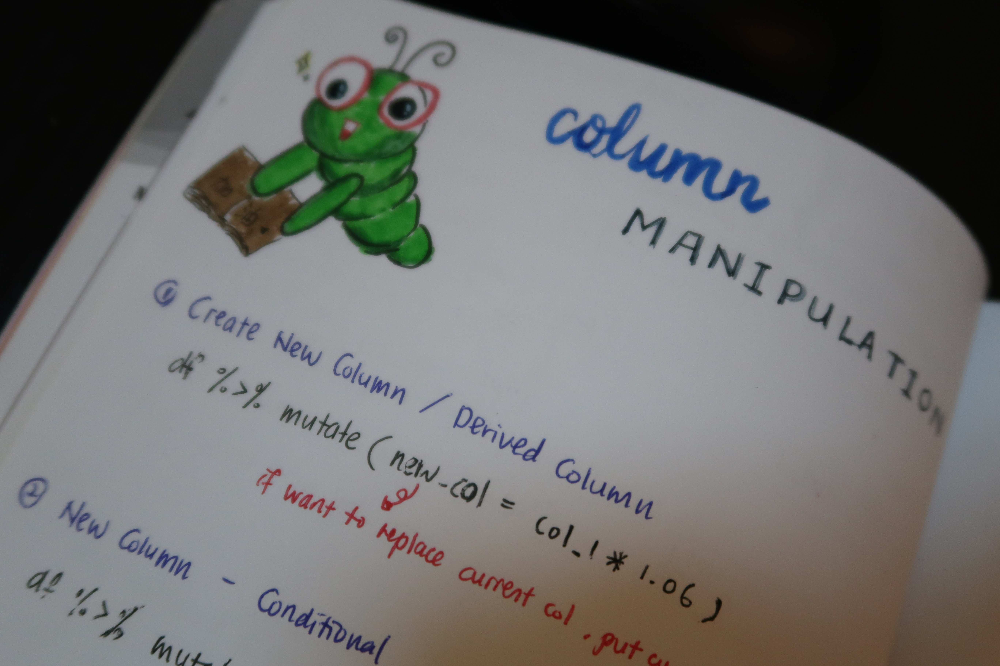

When I was studying in the university, I learnt R programming to complete my final year project, Text Sentiment Analysis and Topic Modeling. It was a nightmare for me as the tasks were not as easy as I thought, especially for someone without strong foundation in data science programming languages (e.g. R, Python).

For a complete beginner, there are plenty of resources you could easily find to pick up a new programming language. Bad new is sometimes there are too much resources that I just could not make up my mind to just choose one. After more than one year of dealing with R (haha), I thought I should share some of my tips in learning R for data analysis.

**1. Read Books**
 
For a complete beginner like me, going through [Hands-On Programming with R][0] is super useful for me! It strengthens my understanding on how R works and how to write a more "R-slang"-like code. Even though the book is lengthy, it is well structured and written. The programming concepts I learned from this book also build my foundation well that I could easily pick up Python when I started working. A KIND Reminder: "Don't skip the hands-on session" - This is where you can put theory into practice. 

**2. Writing Notes**

Personally, I find writing notes in a my notebook is a great way to learn R. Things that I would jot down in my notebook are:
- Concepts that I would take more time to digest
- Solution(s) related to an specific issue/ topic that I find useful _(Usually these will be the solution I found online or written by me)

**3. Google Search**

Learn how to debug your error by looking for solution on Google. Site such as StackOverFlow, R-bloggers.com are some  of the sites that I visited very frequent when I am coding R.

Pretty simple tips!  Be determined and consistent & you will be a R-Master in no time!

**Happy Learning R!**

[0]: https://rstudio-education.github.io/hopr/