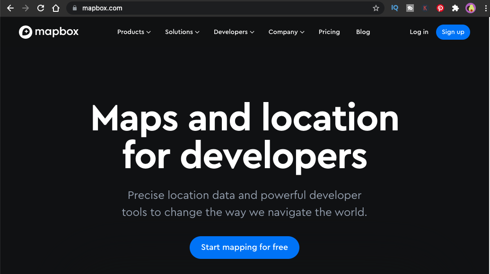
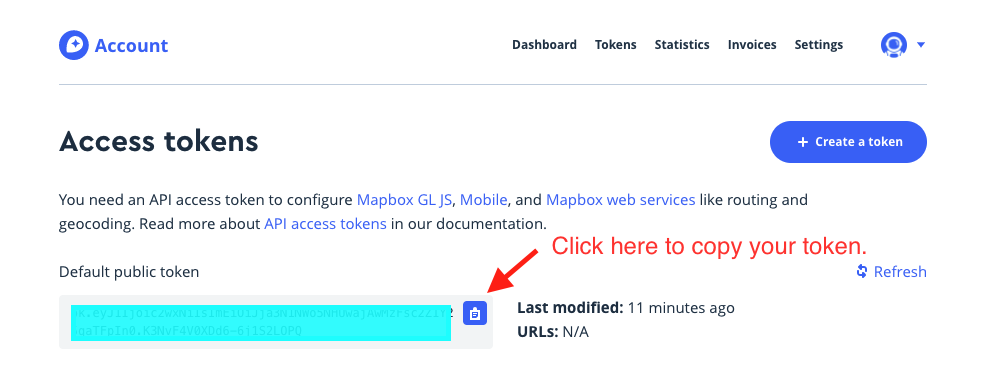
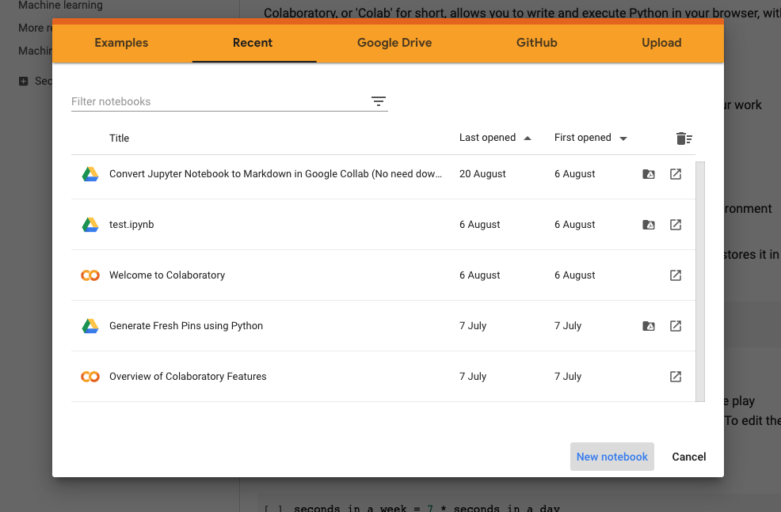
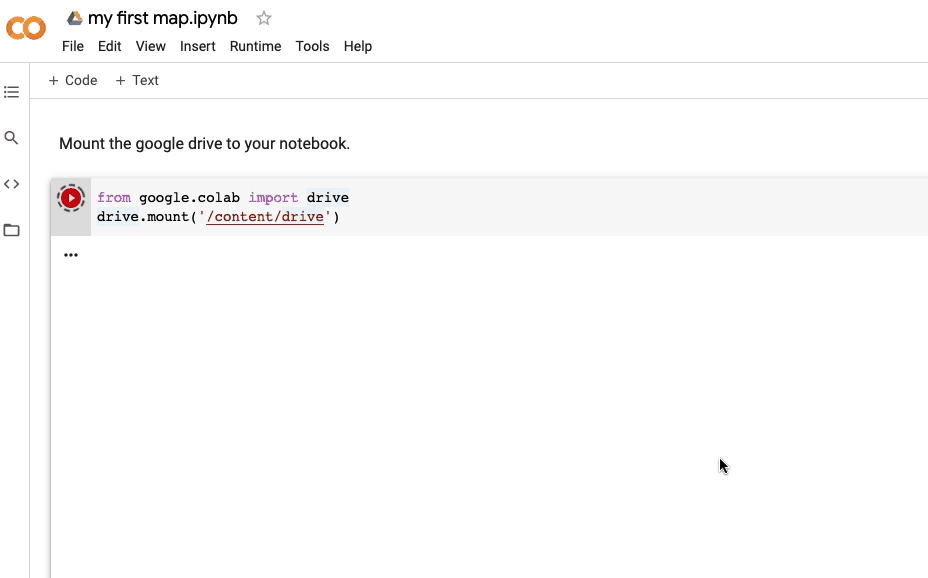

Ever wonder how to create a **customized** and **interactive** geographical map using Python (for **free**)? 

You've come to the right place!

This is a simple tutorial on how to set up **MapBox** and **Plotly** to visualise map data.

At the end of this tutorial, you will be creating your first map that looks like this 👇


**Notes**

*This article is written based on my coding experience in **Google Collab**, so there might be some part which is irrelevant to those using Python in your local computer.*

*I am a **complete beginner** in geo visualisation, this guide is intended for those are are looking for an easy way to start visualise map in the data projects. Appreciate any feedback if any* :)


>
>**Pre-requisites**
>
> 1. MapBox Account and Access Token
> 2. Python Libraries: Pandas & Plotly
> 3. Google Account/ Google Collab
>
> 💡 *Don't have the pre-requisites listed above? Don't worry! We'll cover everything to help you get them.*


### >> Outline
*Outline is provided in case you wish to revisit certain topics.*

**[Part 1: Mapbox Setup]( "Part1")**
- 1.1 Register for MapBox Account
- 1.2 Get your Public Token
- 1.3 Save your Token
- 1.4 Read your Token File to Python Environment

**[Part 2: Python Libraries Installation in Google Collab]( "Part2")**

**[Part 3: Plot your First Map]( "Part 3")** 


---

## Part 1: MapBox Setup


**Mapbox** is a powerful tool to build interactive maps. According to Mapbox own words, "Mapbox is a location data platform that powers the maps and location services.". 

Some popular apps like **Snapchat**, **Lonely Planet**, and even Business Intelligence Tool like **Tableau** are also utilising mapbox technology to empower more analyst and developer to visualise geospatial data at ease!


To use Mapbox mapping services, we need to register for an account at [mapbox.com](http://www.mapbox.com). 

Rest assured no cost would be incurred, because **no credit card required**! * YAY * 

> *Just to make it clear, it's **not a completely free product**. Mapbox do charge if your usage exceed certain threshold.*
>
> *But as a data analyst that just need an interactive map to visualise geo data, it's unlikely that you'll exceed that limit.*

### Step 2: Get your Public Token
Once you completed the registration process, you need to login to your account and go to this [page](https://account.mapbox.com/access-tokens/) to get your access token.



### Step 3: Save your Token

Now we need to save the token in a text file (with .txt extension) and upload it to Google Drive. This additional step is **highly recommended**, but not compulsory. 

This way of accessing the token makes sure that you don't accidentally share your access token in your source code, especially if you are working with others collaboratively on the same project.


### Step 4: Read the Token to Python Environment
We are all set now! Let's create a new noteboook in [Google Collab](https://colab.research.google.com/notebooks/intro.ipynb?utm_source=scs-index#recent=true).



Next, we need to **mount Google Drive** to our notebook. Mounting Google Drive enable us to read files located in Google Drive directly without uploading to Colab workspace. 

```python
from google.colab import drive
drive.mount('/content/drive')
```


 

In short, you'll need to click on the link shown in the terminal. Then, login to your Google Account to get the authorization code. Copy the code and paste in the input box in Notebook.

>
> **Why do we need to mount GDrive instead of uploading it directly to Colab?**
>
> If you upload the token file directly to Colab, **your data would no longer be acessible when you disconnected**. This simply means everytime you work on the project, you'd need to **reimport** the files or dataset again.

Now, get the file path of the token file you just uploaded and replace the placeholder below ( *{enter your file path}* ). If you not sure how to get it, read this **article**.

```python
my_token = open("{enter your file path}").read()
```

---

## Part 2: Python Libraries Installation in Google Colab

As mentioned earlier, we need **2 Python libraries**:-
- **pandas** 

  **Pandas** library is already pre-installed in Colab. So you don't have to install it. We won't be using this package in this tutorial, but we'll need it in the next tutorial if you'd like to follow along.

- **plotly**

  **[Plotly]((https://plotly.com/python/getting-started/))** Python library is an **interactive, open-source plotting library** that supports over 40 unique chart types covering a wide range of *statistical*, *financial*, *geographic*, *scientific*, and *3-dimensional* use-cases.

  To install in Google Collab, simply copy paste code below.

  ```python
  ! pip install plotly==5.2.1
  ```

> 💡  We use disclaimer "!" to specify **terminal command** in Jupyter Notebook.*

---

## Part 3: Your First Map with Plotly & MapBox

Simply run the code below to test if everything was set up correctly.

Here we are using sample dataset from the package to generate the graph.

```python
import plotly.express as px
px.set_mapbox_access_token(my_token)
df = px.data.carshare()
fig = px.scatter_mapbox(df, lat="centroid_lat", lon="centroid_lon",     
                        color="peak_hour", size="car_hours",
                        color_continuous_scale=px.colors.cyclical.IceFire, 
                        size_max=15, zoom=10)
fig.show()
```


**Congratulations!**
You should see this beautiful chart now 💖


---

**Eager to learn more about application or use case that powered by Mapbox?**  Visit [Mapbox Showcase](https://www.mapbox.com/showcase)!

Credit: Cover Photo by Tamas Tuzes-Katai - Unsplash