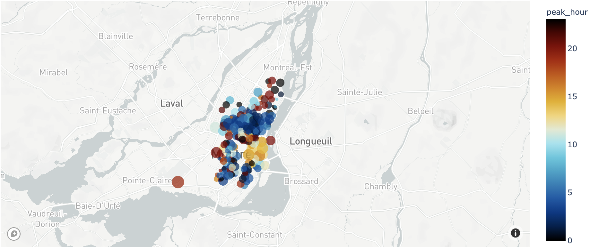

This is a simple tutorial on how to set up MapBox and Plotly to visualise map data. 

At the end of this tutorial, you will be creating your first map.

I did this inside my Google Collab, so there might be some part which is irrelevant to those using Python in your local computer.

## Part 1: Set Up MapBox


### Step 1: Register for MapBox account
No credit card required.

[Link to registration](https://account.mapbox.com/auth/signup/)


### Step 2: Get your Public Token
Link: https://account.mapbox.com/access-tokens/

Visit this link to get your access token.

### Step 3: Save your Token

1.   Copy the token.
2.   Save the token in a text file.
3.   Go to Navigation Bar on the left, click on File Logo. Upload the file.


### Step 4: Read the Token to Python Environment


```python
my_token = open("/content/mapbox_token").read()
```

## Part 2: Set Up Python Environment in Google Collab


### Step 1: Install Required Libraries
Package we need:
- pandas (we won't be using this package in this tutorial, but we'll need it in the next tutorial)
- plotly

---

#### Introduction

![plotly logo.png](data:image/png;base64,iVBORw0KGgoAAAANSUhEUgAAAUMAAACcCAMAAADS8jl7AAAAnFBMVEX///8/T3UzRm8sQGuAz774+frV196jqrrBxtE7THM3SXEsP2uepLUyRW7Y2+KTm66sscCCi6IjOmhMWnxhbIry8/Y7R3FFVXp3gJiD1cI7RnHj5ep/zb20ucbLztbf4edxsq17xbh3vbNqdZFUYoO7v8tUeoxpo6RFW3xKZoFsd5JObYVHX31ilpyAiaBRdIlztq9fkJhahpMbNGT9lZIxAAAKe0lEQVR4nO2daWOiPBDHhXglSC0oUu9atbXtrrv77Pf/bg9HEnKx5ZBi6/zf7DYMGH7mmEwG7HRAIBAIBAKBQCAQCAQCgUAgEAgEAoFAIBAIBAKBQCAQCAQCgUBXp97l1fYtfap6xzfi2peWi8+btu/s0zQMEbGaEHEOd23f3Odo5ONGCMbCzrrt2/sMDZzGCMbyb6A/b1GjCC2Mv//c8tbMUJjJHbV9i00raLYnR8KTtu+xaQ0b7sqRnGXbN9mwBm7jDNF3n1UGdvMMh23fZMMChvUFDOsLGNYXMKwvYFhfwLC+gGF9AcP6MjPEWAkpzhYLa4b/aZOYzIAhw/H+/C4Rm708vqx2v0RCs9fnd5EiTkyeDRBvkuHscT6fP/3IcODTfN7tducCxMVLZLN7nakmz3pM/BYZzl5iGt3VO85Kuol2WcnP2GY1/4Xlk7pdYBi3qOeExtNqxYvCVVwQN0RKCL8nNrtV98SYRSar2ETvzTUZDg6TadlNmd74cBgZ4+fBeDLZXziQpDNc/I7p7CIcrCHiH0mji0r+UECLuGGudkLfPa2oyc8LMzyjaPLyy8XCe5aLsXswHZpER8iF93g0htHAlnbK7vzEyk4xrhjsfxRQ2GU2r5g11dTk6c9lGW799BpBmZPGSVAUDfQj6yTkjI14K0tvh7MdxfPCacye4rbZfZn/wKyAMnxkNounR9nkQgw3aZzdKbVPPU3qQB70I6P0dv0aNdJlGA9/dZMZdhVmRekQ2eVU8etqHvfcbDiMzkpNFur1bpGhNTu97Fa7x5PQoGbPu/nu6WfGB4cv0aTzKDQ6zeSmGVp4EdVBXpXMcIjlRUj8l+yHaya3zPDCymcYDId0rlhuhsPN1mDyD4a9u2F0kmmySRniaXTRRNnGosowq4Gk/rDMd9Ymw8FfhPxjp3M3Jj6K5Dhvmmkew9566jvxSX441vZeU4YWRlS+x44oDAfR5/7VnM/lxEH+tHh6RosMh3569A3xOhAUHgsxXFuIz2Y2OisUp6pv4NwbGW6SGvh9pWKTOPXDNYwE18dwn2apuFKyCnYepAZgZBhMkUSJuPJHaAyxZWT4kHw0eZPrtUlTP/zCLmmLDCfmlD17IrYqE8Otq+UIyQsZjaH118jwkNohuRnT79YvnJ6Rw1CrBHG1iqs2BpO0iuUYWpgILcDAcKsGNxMDEaLeDtnCRGbopfW1x2K1tjQDyS08IJrjh9bJkrwUjLzj0XOxaoMVk7FruL2yDC0y/RfDXmg8zxc+RWWI+UGZYZ/iskVcFCzxOkVlYpjEBl+EdobDpF0vhaLFz8hG8MMxTjyT4FA89iUyJNGkjGxWgLJGpTM8sxpjNzopa/p21nrZvOyk8kNeA2VepoauMDUH9PIlMq1M65Q/yVpvl33fNvXctjzBafac2nCIiE5ugZ4D9TFDjM7D5fJuFLLKZCOUxrDvUxt3cn+3XEazOr2MfVYY4rdgmUgYGhSGNOtNjEHcpzeA94URmtbL7zR+yCOumE9cLOET/+jSGCNdVGPe/c7amPghQxLS76jn0Uy+rCNpDOmIbyE2iPVZ73A5+OLrFHqukJoWaiUVGC4eWfyQxbVs3rXG1HoRR63F+GF20/daQ/yIIT5kw9GYns0dC5UhS33mHl/U9CmIbGoozpCmDhLe6ljLLJN4qjM88djgKZdhEthObN7rM3TFkYe2dD5CqQwpBGnE71OuNisozpANPXzw2NMR8l4/N1eG8ZAx5LFBnSGLMXafqE0NhkbPgt+/ypC5dJIDnPrKFmJGJWIOintT3rHpGGOw/82TqH6XB7YMDJ9TG97dazBUJsC0IeAJvQmFIZ01FTzUR+GNtwRDBZrRY/xIpnn519NqPn965x6iztCavf6ObLLt5Dp92XiXrKEpDOlw6Mqr6p4l33mZ2JfUeSs4Np28+OHp9YfgPxsYJjavmGOuzhArq1U6qLO7UBjSoQ8pYYK0hxPm3ZRhKLk3FRybTrFcERPDxCj7f3WG5CyXMmhb+c9/M5xWZ8icGSd2ZnRXp4iKxBxyGIr6wgwF98bgchcRMBTcmyqOTQcYdoS5eGkKQRQQMORLn/ChimPTAYax9szJTf8p/WxcHsMi83KjDO+MfzbCcCg990nKOTadPIaITOyMhZGha09wtqtRwz+cyqXr9Hzf7GMzhorzUcM/jCVFdZ3SCU1GHxsfg16wJvlrPQvb66DXO/K2WGOdguTSMQ0jm9d6y/TqyswZILmeaeDC5KKYGYp1rpDPZGJI9zOW7MoGhiQdrpb87xoM5X4Zyq1TjTkQ040eXfmD6ExrGNjMDMXAsVv+BRQGhvwqDIfO0GVpabTn1WEojz/HlBlhc6PKkMbG5M7MohcsmENrZdgSyckV8bLAMSn/6gQTQ1YV7i9pDPk3HJDaDC0k7mZYwsorlsqQ4uFxnQQMLeONc0n3C1x19z2P4ZbPKqUdm46RYciqxwDpDH1uwr69GgytbIe9x8oIK1EZ8jploYp7X/suaJQR22oKT17OEnNvKj30b9hP+XSGljNOm/6RhTEQnzO0/RRWBRKmTTU4UxcZW1nTZG9YwM5AzlbIY7hhGzlv6pECugqGlo0fRiNvwnwlHKo3lzHk4z9GB2802ttsKEPiXM13mF3rYXSfdenc3Dm2TVMlU/s6GEYXsG3uS4nvFdL3l9d87MLRSZmHKvmZW1+4sutzTzGPYcWITaprYShKzPsw5IqwDVS51kTutGtfPMo3UvMYGjbri+sKGSJx9WfKWXrQ8wAwVhMUx9ICDtPSHIZ31LiCY9O5QobYl7wLY+7cg/piI4L1HNqB+Co4Bi2H4b5ixIZ+UvsMxVxC7GLZmrYQR+mpthT8UHIW2akhvzIfLOnzKcoOPMsMcEo9BcPVOkNy3hxothImyNKeEJvG10PqiiPwCErnIOKiad5kup44yZUxX0/2MImbujTsZRkqxVNfJV0Bw6jFRC6K7zsHb6i3p54XHTH0seDoTXzfJ28DUyo8U380df2/08y5We59H4sLo+3AYggcbVlTTFfBsC0Fni9k7NnFMw5l3TTDg1jX7L7L6pYZHkVHE1d/PV77DCsO5BeQuLNh8o6KqkWGNGJfdRSqL+G9hWhaza1Jr9Mew7X5CZvPEwszYlR2V15Wiww7Y991/Vq1r6mhg1zXQfua759uk2Fnu163+57T4Lg+9mu/N9kQx8ZsaAhYji53cTlDblKL4TeRgSF311lwN9sCZqFNjoWlQmeBt70WSbhFhjyDkT+v49IF6YbHkBlVHi9GNDP1Tg/u3SJDy03c3t5DdogkEDdZN7XTSImXlaQbS339Sb/bZGgR1xt40gOMznQ0mjqyyciTIlDOYRyZlHhe79soJ2eJ2EQuwMLWRWGT22Z4SQFDYPihgGF9AcP6Aob1BQzrCxjWFzCsr2Pzv0HjVI+yfw0tm/89Kat2gO7aZXiZymXV4obJZ2nTdEP89j/JFenc7IjotLlh8mnaN/nzcH61dLQvp7HT0G89YrtaYulX1NLDLrq4HNca19j5/nra9i+vG5hMQCAQCAQCgUAgEAgEAoFAIBAIBAKBQCAQCATS9D/ycdsVBOGqagAAAABJRU5ErkJggg==)

The plotly Python library is an interactive, open-source plotting library that supports over 40 unique chart types covering a wide range of statistical, financial, geographic, scientific, and 3-dimensional use-cases.

[Getting Started with Plotly]((https://plotly.com/python/getting-started/))


```python
pip install pandas
```

    Requirement already satisfied: pandas in /usr/local/lib/python3.7/dist-packages (1.1.5)
    Requirement already satisfied: numpy>=1.15.4 in /usr/local/lib/python3.7/dist-packages (from pandas) (1.19.5)
    Requirement already satisfied: python-dateutil>=2.7.3 in /usr/local/lib/python3.7/dist-packages (from pandas) (2.8.1)
    Requirement already satisfied: pytz>=2017.2 in /usr/local/lib/python3.7/dist-packages (from pandas) (2018.9)
    Requirement already satisfied: six>=1.5 in /usr/local/lib/python3.7/dist-packages (from python-dateutil>=2.7.3->pandas) (1.15.0)


```python
pip install plotly==4.14.3
```

    Collecting plotly==4.14.3
    [?25l  Downloading https://files.pythonhosted.org/packages/1f/f6/bd3c17c8003b6641df1228e80e1acac97ed8402635e46c2571f8e1ef63af/plotly-4.14.3-py2.py3-none-any.whl (13.2MB)
         |████████████████████████████████| 13.2MB 215kB/s 
    [?25hRequirement already satisfied: retrying>=1.3.3 in /usr/local/lib/python3.7/dist-packages (from plotly==4.14.3) (1.3.3)
    Requirement already satisfied: six in /usr/local/lib/python3.7/dist-packages (from plotly==4.14.3) (1.15.0)
    Installing collected packages: plotly
      Found existing installation: plotly 4.4.1
        Uninstalling plotly-4.4.1:
          Successfully uninstalled plotly-4.4.1
    Successfully installed plotly-4.14.3


## Part 3: Your First Map with Plotly & MapBox

Simply run the code below to test if everything was set up correctly.


```python
import plotly.express as px
px.set_mapbox_access_token(my_token)
df = px.data.carshare()
fig = px.scatter_mapbox(df, lat="centroid_lat", lon="centroid_lon",     color="peak_hour", size="car_hours",
                  color_continuous_scale=px.colors.cyclical.IceFire, size_max=15, zoom=10)
fig.show()
```


## Congratulations! 
You should see this beautiful chart now 💖



