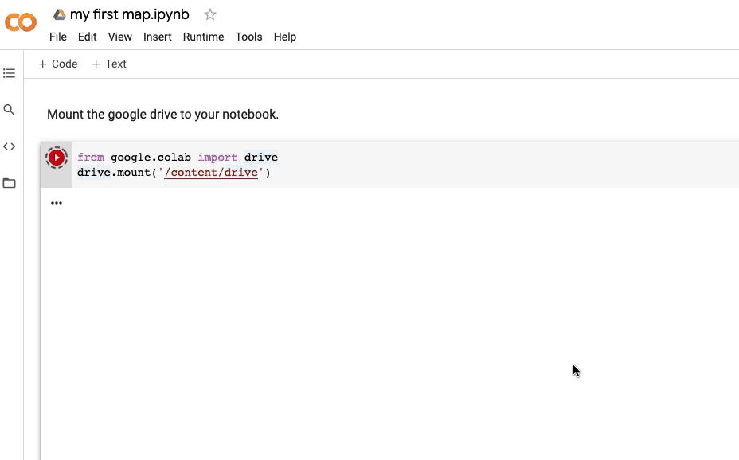
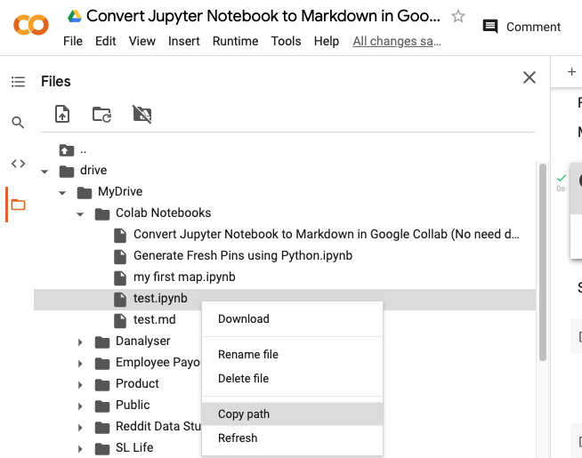

This is a detail guide on how to convert Jupyter Notebook to **Markdown** in **Google Collab** using **nbconvert** package.

* This tutorial is also **applicable** if you wish to convert your Notebook to other static format that [nbconvert](https://nbconvert.readthedocs.io/en/latest/) supports. 
* Supported file type includes **PDF**, **HTML**, **LaTeX**, and so on. However, we'll be focusing on Markdown format specifically.


It comes handy if you wish to publish **Data Science Tutorials** written in **Jupyter Notebook** to blog post format.

> Most of the tutorials I found used the approach of downloading the file to local computer and re-upload it to **Colab workspace**. 
>
>But personally, this is too much of hassle and I'd prefer a more efficient solution - where NO download and upload of files is required.

---

So if you're happened to use Google Colab to document your blog article, I am super excited to share my solution with you!

### >> Outline
*As usual, outline is provided in case you wish to revisit certain topics.*

**[Part 1: Mount Google Drive to Colab]( "Part1")**

**[Part 2: Convert Notebook to MarkDown using nbconvert]( "Part2")**
 
**[Part 3: How the output looks like in Markdown ?]( "Part3")**

---


### Part 1: Mount Google Drive to Colab
First, we need to **mount Google Drive** to our notebook. 

You can understand Mounting Google Drive as attaching our Google Drive to Colab workspace. It enable us to read files located in Google Drive directly without uploading to Colab workspace manually.

Copy the code chunk below and paste it in your notebook.

```
from google.colab import drive
drive.mount('/content/drive')
```

> What this code will do?
> How to mount only a shared folder
> Will we mount the entire folder? (this can open a new blogpost)

#### Authorization
Of course not everyone can mount your Google Drive to their Colab workspace, that'll be exposing your personal data, which is a BIG NO NO. 

Here is where we'll need to provide authorisation if we were to mount drive programmatically. 

**Click on the GIF below to follow the steps.**



Here are the steps in summary:
1. **Run** the code above.
2. **Click** on the **link** shown in your terminal. 
3. You'll get directed to a Sign In Page. **Sign in**.
4. You'll get an lengthy code for authorization. **Copy** that.
5. **Paste** the code into box in your Notebook dedicated box (in terminal)

Once the mounting sucessfully done, you shall see there's a new folder added to your workspace on the left.


> **Quick Tips :**
> A faster way of mounting your drive would be through UI, where we can skip the authorization steps.

### Part 2: Convert Notebook to MarkDown using nbconvert

One of the advantage of using Colab is some of the common packages. This includes nbconvert which we'd use to convert notebook to markdown format. 

So, no installation required! Just replace *{file path}* in the terminal command below with your file path. 

💡  Notice that we use disclaimer "!" to specify **terminal command** in Jupyter Notebook.*
```bash
!jupyter nbconvert --to markdown "{file path}"
```

> **Not sure how to get the file path?**
>> Right click on the file and select "Copy path".
> 

Now you can hit refresh and you should see a new file with the same name as your ipynb file but with .md extension in the same folder.

### How the output looks like in Markdown ?


---

Credit: Cover Photo by [Jeff Sheldon](https://unsplash.com/@ugmonk?utm_source=unsplash&utm_medium=referral&utm_content=creditCopyText) on Unsplash

Photo by <a href="https://unsplash.com/@schmaendels?utm_source=unsplash&utm_medium=referral&utm_content=creditCopyText">Andreas Klassen</a> on <a href="https://unsplash.com/s/photos/efficient?utm_source=unsplash&utm_medium=referral&utm_content=creditCopyText">Unsplash</a>
  